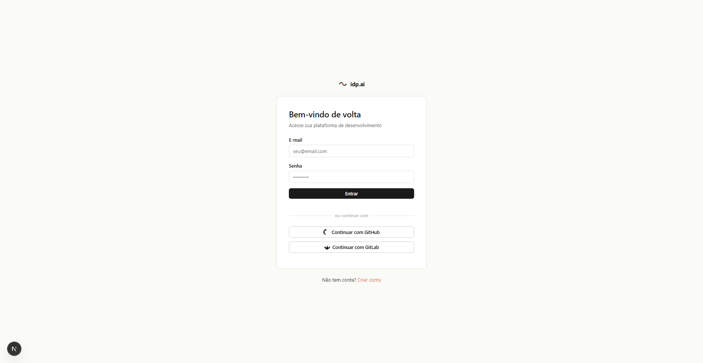
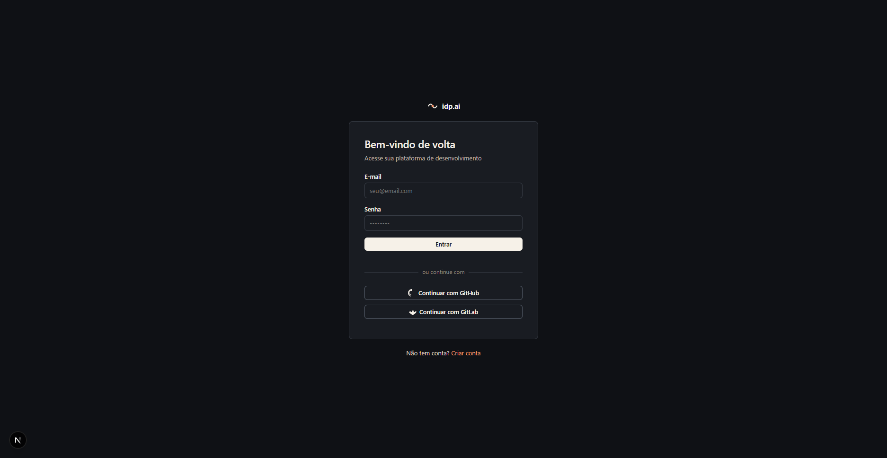
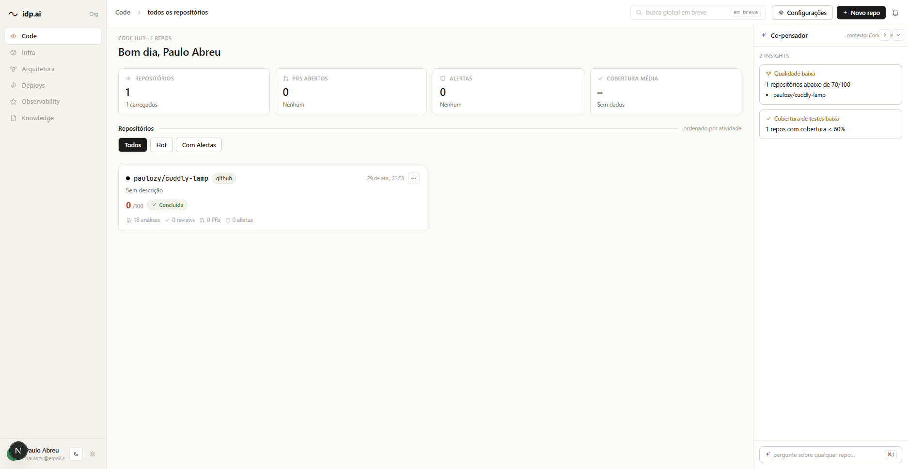
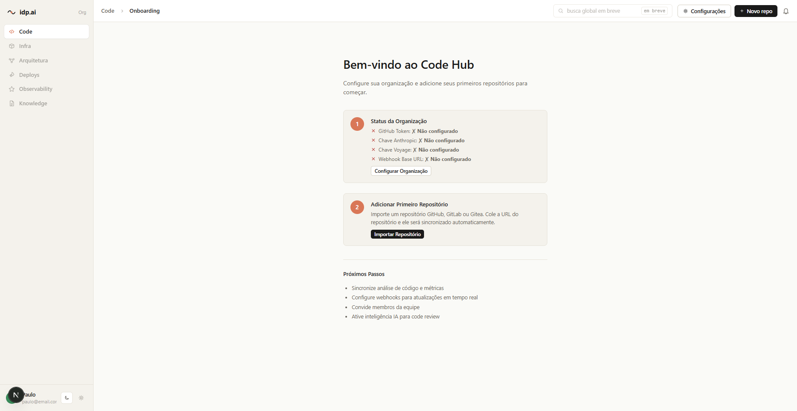
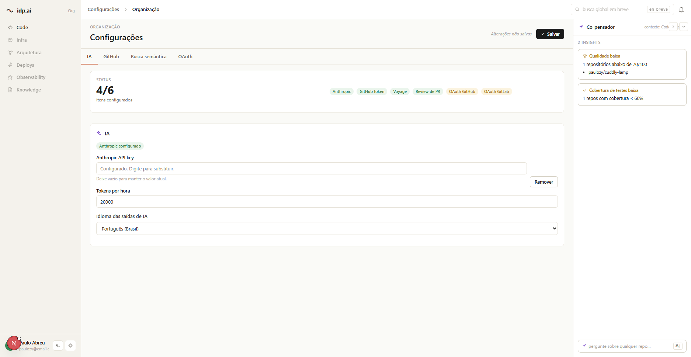

# IDP — Frontend

Frontend do **Code Hub**, uma Internal Developer Platform (IDP) para catálogo de
repositórios, navegação de pull requests, grafo de dependências entre repos,
cobertura vinda do CI e documentação de projeto.

> A geração de documentação é a **única** funcionalidade que usa IA. Review de PR
> assistido, busca semântica e templates de código foram removidos.

Construído com Next.js 15 (App Router), React 19 e TypeScript, seguindo o padrão **Backend For Frontend (BFF)** — todos os tokens ficam em cookies HttpOnly e o navegador nunca fala direto com o backend Go.

---

## Screenshots

| Tela | Preview |
| --- | --- |
| Login (light) |  |
| Login (dark) |  |
| Code Hub — home com repositórios |  |
| Onboarding (organização vazia) |  |
| Configurações da organização |  |

---

## Funcionalidades

- **Autenticação completa**
  - Login e cadastro com e‑mail/senha.
  - Multi‑organização: usuário escolhe org após login quando há mais de uma.
  - OAuth com GitHub e GitLab.
  - Refresh automático de token em 401, com retry transparente da requisição original.
  - Middleware protege todas as rotas em `/(app)/**`.
- **Code Hub (home)**
  - Grid de repositórios com métricas agregadas (PRs, issues, cobertura, linguagens).
  - Modal de importar/criar repositório por URL (GitHub, GitLab, Gitea).
  - Tutorial de onboarding quando a organização ainda não tem repositórios.
- **Visão do repositório**
  - Overview com metadados, sinais de atividade (PRs, issues, contribuidores) e badges de provider.
  - Card de saúde com pills de sync e cobertura; `has_coverage` distingue “não configurado” de 0% medido.
  - Banner de erro quando o sync inicial falhou — exibe a mensagem do backend e indica que a próxima inicialização do servidor reagenda.
  - Listagem de arquivos.
  - Configurações por repositório (tokens de upload de cobertura).
- **Cobertura via CI**
  - Tela de configurações do repositório permite gerar tokens `cov_*` revogáveis com escopo por repositório.
  - O token é exibido **uma vez** logo após a criação, com botão de copiar e snippet pronto pro GitHub Actions já preenchido com o `IDP_REPOSITORY_ID`.
  - CI do projeto usa o token via `POST /api/v1/repositories/:id/coverage` (formatos: Go / LCOV / Cobertura / JaCoCo).
  - Tokens podem ser revogados a qualquer momento pela mesma tela.
- **Pull requests**
  - Listagem dos PRs abertos direto da API do GitHub.
  - Detalhe com descrição, contadores e diff por arquivo (parser de unified diff próprio).
- **Documentação (IA)**
  - Geração por repositório e por organização (ADR, arquitetura, service doc, guidelines).
  - Editor Markdown in-app para ajustar o conteúdo gerado.
- **Grafo de repositórios**
  - Mapa espacial das relações entre repos, com CRUD de relacionamentos.
- **Tema claro/escuro**
  - Toggle persistente na top‑bar, com tokens em CSS vars.
- **Internacionalização**
  - UI em português (pt‑BR), incluindo mensagens de erro do backend mapeadas em `getErrorMessage()`.

---

## Stack

| Camada | Tecnologia |
| --- | --- |
| Framework | [Next.js 15](https://nextjs.org/) (App Router, Route Handlers, middleware) |
| UI | [React 19](https://react.dev/) + componentes próprios com inline styles + tokens |
| Linguagem | [TypeScript 5.8](https://www.typescriptlang.org/) |
| Markdown | [react-markdown](https://github.com/remarkjs/react-markdown) + [remark-gfm](https://github.com/remarkjs/remark-gfm) |
| Testes unitários / componentes | [Jest 29](https://jestjs.io/) + [Testing Library](https://testing-library.com/) |
| Testes E2E | [Playwright](https://playwright.dev/) |

Sem CSS framework e sem biblioteca de componentes externa — todo o design system vive em `src/lib/tokens.ts` e `src/components/ui/`.

---

## Quick start

```bash
# 1. Dependências
npm install

# 2. Variáveis de ambiente
cp .env.example .env.local
# ajuste API_BASE_URL se o backend Go não estiver em http://localhost:3000/api/v1

# 3. Subir o dev server (porta 3001)
npm run dev
```

Acesse http://localhost:3001 — o middleware redireciona para `/login` se não houver sessão.

> O frontend depende do backend Go em `../backend`, que precisa estar rodando para login, OAuth, repositórios, pull requests e documentação funcionarem.

### Variáveis de ambiente

```env
API_BASE_URL=http://localhost:3000/api/v1            # usado pelos Route Handlers (server-only)
NEXT_PUBLIC_API_BASE_URL=http://localhost:3000/api/v1 # exposto ao browser
NODE_ENV=development
```

### OAuth (opcional)

Para que GitHub/GitLab redirecionem de volta ao frontend, configure no backend:

```env
GITHUB_CALLBACK_URL=http://localhost:3001/auth/callback/github
GITLAB_CALLBACK_URL=http://localhost:3001/auth/callback/gitlab
```

---

## Arquitetura BFF

```
┌──────────┐   fetch    ┌────────────────────┐   fetch    ┌─────────────┐
│ Browser  │ ─────────► │  Next.js (3001)    │ ─────────► │ Go backend  │
│          │            │  Route Handlers    │            │  (3000)     │
│          │ ◄───────── │  /api/auth/*       │ ◄───────── │             │
└──────────┘  HttpOnly  │  /api/repositories │            └─────────────┘
              cookies   │  /api/organization │
                        └────────────────────┘
```

- **Tokens** vivem em cookies `HttpOnly`, `SameSite=Lax`. JS no browser nunca os enxerga.
- **`access_token`** TTL ≈ 15 min · **`refresh_token`** TTL ≈ 7 dias · **`login_ticket`** TTL 5 min (multi-org).
- **Refresh automático**: ao receber 401, o cliente chama `/api/auth/refresh`, recebe um novo par e re‑executa a request original. Falhou de novo → redirect para `/login`.
- **`API_BASE_URL`** nunca é exposta ao browser — apenas Route Handlers a usam.

---

## Estrutura de pastas

```
src/
├── app/
│   ├── (auth)/                 # rotas públicas: /login, /register, /selecionar-organizacao
│   ├── (app)/                  # rotas protegidas
│   │   ├── page.tsx            # Code Hub home
│   │   ├── code/repositories/[id]/
│   │   │   ├── page.tsx        # overview do repo
│   │   │   ├── files/          # navegação de arquivos
│   │   │   ├── pull-requests/  # lista e detalhe de PR com diff
│   │   │   └── settings/       # configurações do repo
│   │   ├── docs/               # documentação (org e por repo)
│   │   ├── graph/              # grafo de relacionamentos
│   │   └── settings/           # configurações da organização
│   ├── api/                    # Route Handlers (BFF)
│   │   ├── auth/{login,register,refresh,logout,me,select-organization}/
│   │   ├── repositories/[id]/{pull-requests,docs,coverage,sync}/
│   │   └── organization/config/
│   └── auth/{callback,oauth}/[provider]/   # OAuth GitHub/GitLab
│
├── components/
│   ├── auth/                   # AuthShell, OAuthButton, Logo
│   ├── home/                   # RepositoryGrid, MetricStrip, NewRepoModal, OnboardingTutorial
│   ├── pull-requests/          # PullRequestList, PullRequestCard, DiffView
│   ├── docs/                   # editor/viewer Markdown e modais de geração
│   ├── graph/                  # RepoGraph, RepoNode, RelationshipModal
│   ├── repository/             # RepoHealthCard, ProjectStackCard, CoverageTokensSection
│   ├── shell/                  # AppShell, ThemeToggle, tab bars, CommandPalette
│   ├── icons/                  # MFIcon (ícones internos)
│   └── ui/                     # Button, Input, Card, Alert, Tag, Toggle
│
├── lib/
│   ├── tokens.ts               # design tokens (cores, fontes, raios)
│   ├── cookies.ts              # helpers de cookie (server-only)
│   ├── api/                    # clientes server-side e wrapper de fetch do browser
│   ├── types/                  # interfaces auth, repository, organization, pull_request, docs
│   ├── repo-metrics.ts         # agregações de métrica do Code Hub
│   ├── coverage.ts             # rótulos/variantes de status de sync e cobertura
│   └── diff.ts                 # parser de unified diff
│
└── middleware.ts               # protege /(app)/** verificando access_token

e2e/                            # Playwright specs
plans/                          # specs de produto por feature
```

---

## Scripts npm

| Comando | O que faz |
| --- | --- |
| `npm run dev` | Sobe o dev server em `http://localhost:3001` |
| `npm run build` | Build de produção |
| `npm start` | Sobe o build de produção em `:3001` |
| `npm run lint` | Lint do Next.js |
| `npm test` | Roda os 4 projetos Jest (`unit`, `components`, `routes`, `pages`) |
| `npm run test:watch` | Jest em modo watch |
| `npm run e2e` | Playwright E2E (sobe o dev server automaticamente) |

O Playwright sobe o dev server sozinho, mas **não** sobe o backend. As specs em
`e2e/` rodam contra a stack determinística do repo do backend — Postgres e Redis
descartáveis, um GitLab falso servindo payloads capturados do gitlab.com, e o
servidor real:

```bash
cd ../backend && make e2e-stack   # deixa a stack aberta em :3000 (Ctrl-C encerra)
cd ../frontend && npm run e2e
```

Filtrar suíte específica:

```bash
npm test -- --testPathPattern=api/auth
npm test -- --testPathPattern=components
```

---

## Principais fluxos

### Login single-org
```
POST /api/auth/login → backend retorna 200 + tokens
→ setAuthCookies(access_token, refresh_token)
→ browser redireciona para /
```

### Login multi-org
```
POST /api/auth/login → backend retorna 202 + organizations[]
→ setLoginTicketCookie(ticket)
→ browser → /selecionar-organizacao
→ POST /api/auth/select-organization { organization_id }
→ setAuthCookies(...) + deleteLoginTicketCookie()
→ /
```

### OAuth (GitHub/GitLab)
```
/auth/oauth/github?organization_name=X
→ backend redireciona p/ provider
→ provider → /auth/callback/github?code&state
→ backend troca code por token
→ setAuthCookies + redirect /
```

### Token expirado
```
GET /api/protected → 401
→ POST /api/auth/refresh (lê refresh_token do cookie)
→ rotaciona tokens, atualiza cookies
→ retry da request original (uma vez)
→ se falhar de novo, /login
```

---

## Design system

Tudo vive em `src/lib/tokens.ts` e nos componentes em `src/components/ui/`. Tokens são CSS vars, então o tema escuro é uma simples troca de variáveis.

**Cores principais (light)**

| Token | Hex | Uso |
| --- | --- | --- |
| `bg` | `#fafaf7` | fundo da app |
| `surface` | `#ffffff` | cards |
| `accent` | `#d97757` | ações primárias (terracota) |
| `ai` | `#7a4cc8` | tudo relacionado à IA (roxo) |
| `ok` | `#2e7d3e` | sucesso |
| `warn` | `#c89a3a` | aviso |
| `danger` | `#b8413b` | erro |

**Tipografia**: Inter (UI) e JetBrains Mono (código). Base 13px, h1 22px, h2 16px.

**Raios**: card 8px · button/input 6px · tag 10px.

---

## Segurança

### Permissões na UI

`src/lib/permissions.ts` espelha a hierarquia de papéis do backend
(`viewer < developer < maintainer < admin`) e exporta capacidades nomeadas
(`canCreateRepository`, `canDeleteRepository`, `canManageCoverageTokens`, …),
uma por rota protegida em `internal/api/routes.go`.

Isso é **só apresentação** — quem autoriza é a API. Esconder um controle que a
API recusaria é conveniência; mostrar um que ela recusaria é o bug que esse
módulo evita. Ao adicionar uma ação nova, use uma capacidade em vez de comparar
o papel na mão, e mantenha o mapa em sincronia com o backend.

O papel considerado é o da **associação à organização** (`organization.role`),
que é o mesmo em que o backend gateia (`claims.OrganizationRole`).

1. **HttpOnly cookies** — tokens fora do alcance de JS, mitiga XSS.
2. **SameSite=Lax** — protege contra CSRF mantendo OAuth funcional.
3. **Secure** em produção — exige HTTPS.
4. **Sem `localStorage`** para tokens.
5. **Single retry no refresh** — evita loops em sessão inválida.
6. **`API_BASE_URL` server-only** — backend nunca é chamado direto do browser.
7. **Middleware** valida cookie antes do render da página protegida.

---

## Deploy

1. Apontar `API_BASE_URL` para o backend de produção.
2. Atualizar callbacks OAuth (GitHub/GitLab) para o domínio de produção.
3. `NODE_ENV=production` (cookie `Secure` exige HTTPS).
4. `npm test && npm run e2e`.
5. `npm run build && npm start`.

---

## Documentação relacionada

- `IMPLEMENTATION.md` — detalhes do fluxo de autenticação.
- `plans/` — specs de produto por feature: `auth-flow.md`, `codehub-inicial-page.md`. (`semantic-search.md` e `code-review-flow.md` descrevem features removidas e ficam só como registro histórico.)
- `../backend/` — backend Go que serve a API consumida via BFF.
- `../design/` — mid‑fis e protótipos JSX (`flow-shell.jsx`, `midfi-kit.jsx`, etc.) que guiam a UI.
