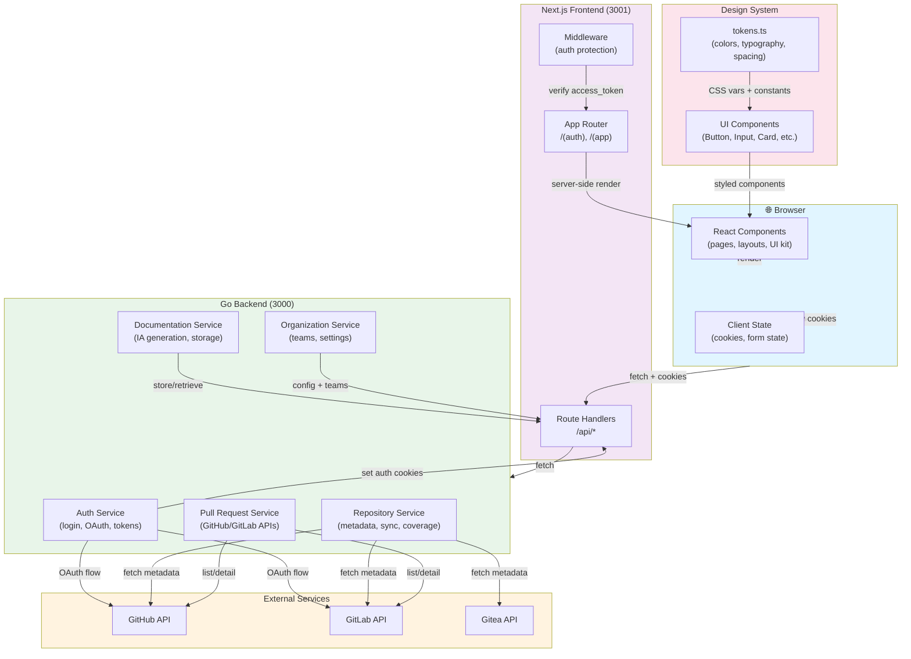

# Architecture

## Component Diagram



## System Overview

**IDP — Frontend** é uma Internal Developer Platform (plataforma de desenvolvedor interna) construída em **Next.js 15** com **React 19** e **TypeScript**. Funciona como um catálogo centralizado de repositórios, oferecendo visibilidade em pull requests, cobertura de testes, dependências entre projetos e documentação arquitetural assistida por IA.

O frontend segue o padrão **Backend For Frontend (BFF)**, garantindo que tokens de autenticação **nunca** são expostos ao navegador — vivem em cookies `HttpOnly` e todas as requisições ao backend Go passam por Route Handlers server-side.

---

## Architecture Layers

### 1. **Presentation Layer** (React Components)

Organizada por feature com ênfase em **composição** sobre integração:

- **`(auth)/**`** — Fluxos públicos: login, cadastro, seleção de organização, callbacks OAuth
- **`(app)/**`** — Páginas protegidas: Code Hub (home), repositórios, documentação, grafo, configurações
- **Design System** (`src/lib/tokens.ts` + `src/components/ui/`) — Sistema próprio de design sem dependências de framework CSS; todas as cores, tipografia e spacing vivem em tokens reutilizáveis

Componentes são stateless ou usam React hooks mínimos; estado complexo é gerenciado no servidor (Next.js App Router).

### 2. **BFF Layer** (Route Handlers)

Todos os endpoints em `/api/**` atuam como **proxy autenticado** para o backend Go:

- **`/api/auth/*`** — Login, logout, refresh de tokens, seleção de organização, endpoint `/me` para contexto do usuário
- **`/api/repositories/**`** — Metadados, listagem de PRs, geração de documentação, tokens de cobertura, sync
- **`/api/organization/**`** — Configurações globais, onboarding, times
- **Retry automático em 401** — Ao receber unauthorized, o handler chama `/api/auth/refresh`, obtém novos tokens e re-executa a requisição original

Tokens nunca são expostos em `NEXT_PUBLIC_*`; apenas `API_BASE_URL` server-side é conhecida.

### 3. **Middleware Layer**

Arquivo `src/middleware.ts` protege todas as rotas em `/(app)/**`:

- Verifica presença e validade de `access_token` em cookies
- Redireciona para `/login` se não autenticado
- Passa controle adiante se token é válido

### 4. **Backend Layer** (Go)

Serviço externo responsável por:

- **Autenticação** — Credenciais locais, OAuth GitHub/GitLab, geração de tokens JWT
- **Sincronização de repositórios** — Pull de metadados e PRs via APIs do GitHub, GitLab, Gitea
- **Documentação com IA** — Prompt engineering para gerar ADRs, guias arquiteturais, service docs
- **Persistência** — Postgres para dados, Redis para cache de sessões

---

## Key Technical Decisions

### 1. **HttpOnly Cookies + BFF Pattern**

- **Por quê**: Elimina risco de XSS exfiltrar tokens; backend Go mantém lógica de validação centralizada
- **Como**: Todos os endpoints de autenticação no frontend são Route Handlers que chamam o backend; o navegador não fala direto com Go
- **Trade-off**: Adiciona latência mínima (millisegundos) nas requisições; benefício de segurança compensa

### 2. **App Router + Server Components**

- **Por quê**: Renderização server-side reduz JS no cliente; dados sensíveis nunca trafegam por JSON ao browser
- **Como**: Layout hierarchy em `(auth)` e `(app)`; Middleware protege tudo em `(app)` antes do render
- **Trade-off**: Menos reatividade que SPA puro; requisições mais lentas em conexões pobres

### 3. **Design System Baseado em Tokens**

- **Por quê**: Evita vendor lock-in a frameworks CSS; facilita tema dark/light e futuras migrações de design
- **Como**: `src/lib/tokens.ts` centraliza cores, tipografia, espaçamento; componentes em `src/components/ui/` usam inline styles com tokens
- **Trade-off**: Sem abstração de componentes de terceiros; mais código próprio a manter

### 4. **Markdown com Shiki + Remark GFM**

- **Por quê**: Documentação renderizada no cliente com syntax highlighting bonito; suporte a tabelas, listas de tarefas, strikethrough via GFM
- **Como**: `react-markdown` + `remark-gfm` + `shiki` para highlight; editor `@uiw/react-md-editor` para edição in-app
- **Trade-off**: Bundle +150KB; compensado por UX sem round-trips ao servidor para renderizar

### 5. **Onboarding Orientado a Dados**

- **Por quê**: Fluxos de onboarding são configuráveis no backend, não hardcoded no frontend
- **Como**: Admin monta passos em Configurações; `/onboarding` é um runner genérico; referências a repositórios, times, docs são resolvidas server-side em tempo real
- **Trade-off**: Cliente não sabe exatamente o que renderizar até fazer fetch; estado de indisponibilidade é esperado

### 6. **Cobertura de Testes em Camadas**

- **Jest 29** — Unit tests para utilitários, integração de componentes
- **Testing Library** — Comportamento de componentes (não implementação)
- **Playwright** — Fluxos E2E em navegador real (login, multi-org, OAuth, sync de repos, geração de docs)
- **Trade-off**: Setup complexo com mock de providers (GitLab falso); benefício é confiança em mudanças

---

## Data Flow

### Autenticação (Single-Org)

```
1. Usuário submete form em /login
2. POST /api/auth/login { email, password }
   → Route Handler chama backend Go
   → Go autentica + retorna access_token + refresh_token
3. Frontend setAuthCookies() → ambos em HttpOnly
4. Middleware permite acesso a /(app)/**
```

### Autenticação (Multi-Org)

```
1. POST /api/auth/login
   → Backend retorna 202 + lista de organizações
2. Frontend armazena login_ticket em cookie
3. Usuário navega para /selecionar-organizacao
4. POST /api/auth/select-organization { organization_id }
   → Backend cria nova sessão para org escolhida
5. setAuthCookies() → deletaLoginTicket() → redireciona /
```

### Requisição Protegida com Token Expirado

```
1. GET /api/repositories (componente tenta listar repos)
2. Access token expirado → backend retorna 401
3. Route Handler detecta 401 → POST /api/auth/refresh
   → Refresh token ainda válido → nova sessão
4. Route Handler retry automático da requisição original
5. Sucesso → dados ao cliente
```

### Integração com Serviços Externos

```
Frontend (/api/repositories/[id]/pull-requests)
  ↓
Route Handler (server-side)
  ↓
Backend Go (resolve token GitHub/GitLab da org)
  ↓
GitHub/GitLab API (fetch PRs)
  ↓
Resposta ao cliente (JSON normalizado)
```

---

## Folder Structure Highlights

```
src/
├── app/                     # Next.js App Router
│   ├── (auth)/              # public routes
│   ├── (app)/               # protected routes (middleware checks)
│   ├── api/                 # BFF route handlers
│   └── auth/                # OAuth callbacks
├── components/              # React components organized by feature
│   ├── auth/, home/, pull-requests/, docs/, graph/, repository/, shell/
│   └── ui/                  # design system components
├── lib/
│   ├── tokens.ts            # design tokens + CSS vars
│   ├── types/               # TypeScript interfaces
│   ├── api/                 # fetch wrappers + client utilities
│   ├── cookies.ts           # server-only cookie helpers
│   ├── diff.ts              # unified diff parser
│   └── coverage.ts          # coverage + sync status utilities
└── middleware.ts            # auth protection + redirection
```

---

## External Dependencies

| Lib | Propósito | Nota |
| --- | --- | --- |
| `next` | Framework web, routing, SSR, middleware | v15 com App Router |
| `react` | UI library | v19 com Server Components |
| `react-markdown` | Renderização de Markdown | +remark-gfm, shiki |
| `@xyflow/react` | Renderização de grafo de repos | React Flow |
| `cmdk` | Command palette (busca) | UI/UX tipo VSCode |
| `zod` | Validação de dados | Type-safe parsing |
| `pino` | Logging estruturado | Server-side apenas |
| `jest`, `@testing-library/react` | Testes | Com Playwright para E2E |

---

## Security Posture

1. **Tokens em HttpOnly cookies** — Mitigação de XSS token theft
2. **BFF pattern** — Backend Go centraliza validação; frontend nunca enxerga credenciais
3. **Middleware de proteção** — Todas as rotas de app verificam `access_token` válido
4. **Refresh automático** — Tokens de curta vida (15 min access, 7 dias refresh); rotação transparente
5. **CSRF implícito** — Cookies `SameSite=Lax`; requisições cross-origin sem credenciais

---

## Performance Considerations

- **Server-side rendering** — Primeiras páginas renderizam no servidor, reduzem TTL
- **CSS-in-JS mínimo** — Inline styles com tokens evitam FOUC e runtime recalc
- **Code splitting** — Next.js automaticamente split rotas; componentes lazy-load via dynamic imports
- **Image optimization** — Next.js `Image` component; respeitossaurímages em docs renderizadas por Markdown
- **Markdown bundle** — `react-markdown` + `shiki` (+150KB); compensado por UX (sem round-trips de render)

---

## Future Extensibility

1. **Múltiplos provedores de repositório** — Padrão interface em lib/api; nova integração é novo provider handler
2. **Temas plugáveis** — tokens.ts é um módulo isolado; trocar por outro scheme é questão de re-export
3. **Geração de documentação** — Lógica de IA vive no backend; frontend apenas orquestra UX (request, spinner, editor)
4. **Onboarding dinâmico** — Backend decide estrutura; cliente roda como state machine genérico